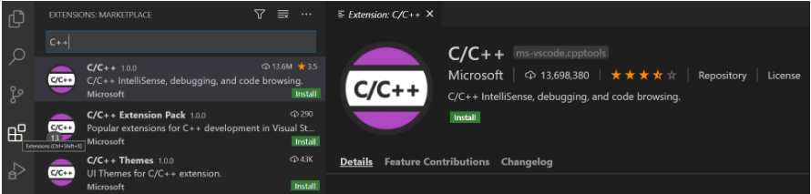
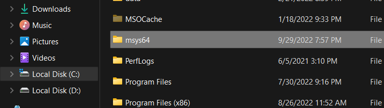

## Setting Up C++ on Visual Studio Code

Configure Visual Studio Code to use the `GCC C++ compiler (g++)` and `GDB debugger` from `mingw-w64` to create programs that run on Windows

### Prerequisites

- Install [Visual Studio Code](https://code.visualstudio.com/download)
- Install the `C/C++ extension` for VS Code. You can install the C/C++ extension by searching for 'c++' in the Extensions view `(Ctrl+Shift+X)`



- Extract `msys64.zip` to disk `C:\`



- Add the path of Mingw-w64 bin folder to the `Windows PATH environment` variable by using the following steps:

> - In the Windows `search bar`, type 'settings' to open your Windows Settings
> - Search for Edit environment variables for your account
> - Choose the `Path variable` in your `User variables` and then select `Edit`.
> - Select `New` and add the `Mingw-w64 `destination folder path to the system path. The exact path depends on which version of Mingw-w64 you have installed and where you installed it. If you used the settings above to install Mingw-w64, then add this to the path: `C:\msys64\mingw64\bin`.
> - Select `OK` to save the updated PATH

### Check your MinGW installation

To check that your Mingw-w64 tools are correctly installed and available, open a `new Command Prompt` and type:

```
gcc --version
g++ --version
gdb --version
```

### Create Hello World [Application](https://code.visualstudio.com/docs/cpp/config-mingw#_create-hello-world)
